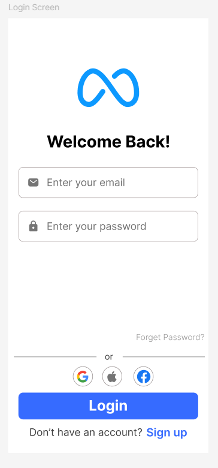
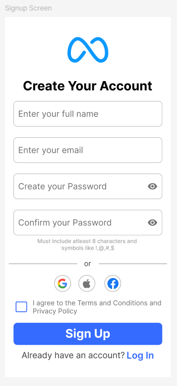

# Mobile App Login & Signup UI Kit


A clean, modern, and user-friendly UI design for a mobile app authentication flow, featuring a Login screen and a Signup screen. This project focuses on applying core UI/UX principles to create a seamless and intuitive user experience.

## 🚀 Preview

Here's a preview of the main screens and the user flow between them.

| Login Screen | Signup Screen |
| :---: | :---: |
|  |  |

*User flow is detailed in the design source file, showing the interactive path between the login and signup pages.*

## ✨ Features

- **Two Main Screens:** A complete flow for both user Login and Sign Up.
- **Social Media Integration:** Buttons for quick authentication via Google, Apple, and Facebook.
- **User-Friendly Forms:**
    - Icons in input fields for clarity (email, password).
    - Password visibility toggle to reduce user errors.
    - Clear helper text for password requirements.
- **Clean & Minimalist Design:** A modern aesthetic with ample white space and a harmonious color palette.
- **Clear Navigation:** Obvious links to switch between login and signup forms, ensuring a smooth user journey.

## 🎨 Design Principles Applied

- **Visual Hierarchy:** Important elements like the logo, heading, and primary action buttons are emphasized to guide the user's attention.
- **Consistency:** Components such as buttons, input fields, and typography are styled consistently across both screens.
- **Clarity:** Clear labels, universal icons, and logical layout make the interface easy to understand and use.
- **User Flow:** The connection between the two screens is explicitly designed to be intuitive.

## 🛠️ Tools, Files, and Resources

This section details all the assets and software used to create this design.

### Files Included

* `Login-Signup-UI.fig`: The main source file containing the design components, screens, and prototypes.
* `Screenshots/`: A directory containing the PNG preview images.
    * `login_screen.png`
    * `signup_screen.png`
    * `user_flow.png`

### Design Tools

* **[Figma](https://www.figma.com/):** The primary design and prototyping tool used to create the screens and user flow.
    * *Alternatives:* The design could also be implemented using [Sketch](https://www.sketch.com/) or [Adobe XD](https://www.adobe.com/products/xd.html).

### Resources Used

* **Typography:**
    * **Font Family:** **Inter**, a free and open-source font from [Google Fonts](https://fonts.google.com/specimen/Inter).
    * **Weights Used:** Bold (Headings), SemiBold (Buttons), Regular (Input Text).
* **Icons:**
    * **UI Icons:** [Iconify Icons](https://iconify.com/) (for email, lock, and eye icons).
    * **Social Logos:** Official SVG logos for Google, Apple, and Facebook.

## 🎨 Color Palette

| Color | Hex Code | Usage |
| :--- | :--- | :--- |
| **Primary Blue** | `#4A69FF` | Primary Buttons, Links, Logo |
| **Dark Text** | `#0D1117` | Headings, Body Text |
| **Gray Text** | `#57606A` | Input Placeholders, Helper Text |
| **Border / Divider** | `#D0D7DE` | Input Fields, Dividers |
| **Background** | `#FFFFFF` | Main Screen Background |

## ⚙️ How to Use

1.  **Clone the repository:**
    ```bash
    git clone [https://github.com/your-username/Auth-UI-Kit.git](https://github.com/your-username/Auth-UI-Kit.git)
    ```
2.  **Install the font:** Make sure you have the [Inter font family](https://fonts.google.com/specimen/Inter) installed on your system.
3. **Open the source file:** Open the [Login-Signup-UI.fig](https://www.figma.com/proto/hQt9FJZqia19adGETR4LSK/Mobile-App-Login--Signup-Screen?node-id=0-1&t=iAbB3xWN7tFZxTbn-1) file in Figma to inspect, modify, or export the assets.

## 📄 License

This project is licensed under the MIT License. See the [LICENSE](LICENSE) file for details.
